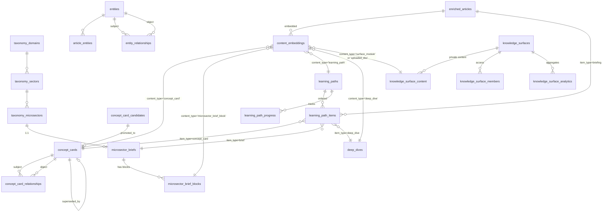

# Learn System — Schema Design

**Status**: Phase 1 draft. Awaiting user review at the Phase 1 checkpoint.
**Sibling docs**: [00-agent-team-plan.md](./00-agent-team-plan.md), [02-edge-cases.md](./02-edge-cases.md)

---

## 1. Design principles

The Learn system sits **on top of** the existing intelligence substrate (`enriched_articles`, `entities`, `taxonomy_*`, `entity_relationships`, `content_embeddings`). Every Learn table is **additive** — no `ALTER` on existing tables except additive column additions (`taxonomy_microsectors.deprecated_at/merged_into`, `enrichment_runs.module`, `content_embeddings.content_type` CHECK expansion).

Four design principles guide the schema:

1. **Orthogonal to existing registries.** `concept_cards` is not a reskin of `entities`. Entities are a registry of proper nouns (companies, projects, regulations, people). Concept cards are reader-facing *definitions of terms* (MLF, REZ, Safeguard Mechanism, Capacity). They may reference entity_ids but never replace them. A concept card can exist with zero entity references ("Marginal Loss Factor" is not an entity); an entity can exist with no card ("AGL Energy" is an entity but won't get a card).

2. **Version-pinned references, not immutable content.** Content evolves. References from old briefings to concept cards pin both `concept_card_id` and `concept_card_version`, so future drift can be detected and surfaced honestly rather than silently rewritten.

3. **Editorial state is a column pattern, applied uniformly.** Every table that holds reader-facing content gets the same triple: `editorial_status` (shared enum), `reviewed_by` (nullable user FK), `reviewed_at` (nullable timestamptz). One `<EditorialStatusBadge>` component consumes this pattern everywhere in Phase 3.

4. **Surface-private content is never visible to canonical retrieval.** `knowledge_surface_content` is indexed into a separate retrieval scope; the scope filter (Phase 4) injects `surface_id` into every query when the caller is inside a surface context, and rejects surface-private rows when the caller is in canonical context. No data leakage between client microsites and the public product.

---

## 2. ER diagram (mermaid)



---

## 3. New tables (by area)

### 3.1 Shared prelude (`001-learn-prelude.sql`)

**Enum** `editorial_status` — five states, used by concept_cards, microsector_briefs, microsector_brief_blocks, learning_paths:
- `editor_authored` — written by a human editor from scratch.
- `editor_reviewed` — AI draft reviewed and approved (or lightly edited) by an editor.
- `previously_reviewed_stale` — was `editor_reviewed` but `reviewed_at` has exceeded the 180-day decay window (see edge-case #3).
- `ai_drafted` — AI-generated, awaiting review. Default state for new drafts.
- `user_generated` — authored by an end user (e.g., a user-requested learning path).

**Trigger function** `update_updated_at()` — standard `BEFORE UPDATE` trigger body that sets `updated_at = NOW()`. Attached to every Learn table with an `updated_at` column.

**Additive column additions** (existing tables, additive only):
- `taxonomy_microsectors.deprecated_at TIMESTAMPTZ` — soft-delete for taxonomy evolution (edge-case #7).
- `taxonomy_microsectors.merged_into INTEGER REFERENCES taxonomy_microsectors(id)` — nullable; set when a deprecated microsector was merged (not split) into a single successor.
- `enrichment_runs.module TEXT DEFAULT 'enrichment'` — lets Learn reuse the existing cost table with a clean filter.
- `content_embeddings.content_type` CHECK expansion — add `concept_card`, `microsector_brief`, `microsector_brief_block`, `learning_path`, `deep_dive`, `surface_module`, `uploaded_doc`. The existing catch-all slot `learn_content` is retained for backwards compatibility (no rows stored with it yet) but marked deprecated in the migration comment.

**View** `generation_costs` — projects `enrichment_runs` filtered to non-enrichment modules for Learn-specific cost tracking. SQL:
```sql
CREATE OR REPLACE VIEW generation_costs AS
SELECT ran_at::date AS day, module, stage, pipeline_version,
       SUM(input_tokens) AS input_tokens,
       SUM(output_tokens) AS output_tokens,
       SUM(estimated_cost_usd) AS cost_usd,
       SUM(articles_processed) AS items_processed,
       SUM(errors) AS errors,
       AVG(duration_ms) AS avg_duration_ms,
       COUNT(*) AS runs
FROM enrichment_runs
GROUP BY 1, 2, 3, 4;
```

---

### 3.2 Concept cards (`010-concept-cards.sql`)

**`concept_cards`** — the canonical definition of a term. Columns:

| Column | Type | Notes |
|---|---|---|
| `id` | UUID PK, gen_random_uuid() | |
| `slug` | TEXT NOT NULL | URL-safe, lowercase-hyphenated. Unique on (slug, disambiguation_context). |
| `term` | TEXT NOT NULL | Display name ("Marginal Loss Factor"). |
| `abbrev` | TEXT | "MLF"; nullable. |
| `disambiguation_context` | TEXT DEFAULT '' | Empty string when the term is unambiguous; populated ("markets", "corporate") when multiple cards share a term. See edge-case #1. |
| `inline_summary` | TEXT NOT NULL | 60-word summary shown on hover tooltips and list contexts. |
| `full_body` | TEXT NOT NULL | ~200-word reader-facing body (renders on the full concept page). |
| `key_mechanisms` | JSONB | Array of `{title, body}` mechanism entries. |
| `related_terms` | TEXT[] DEFAULT '{}' | LLM-proposed related terms; hints at relationships to create in `concept_card_relationships`. |
| `visual_type` | TEXT | One of: `none`, `chart`, `map`, `diagram`, `photo`. |
| `visual_spec` | JSONB | Spec for the visual — shape depends on visual_type (chart config, map SVG refs, etc). |
| `uncertainty_flags` | JSONB DEFAULT '[]'::jsonb | LLM self-reported uncertainty annotations (e.g., date-sensitive claims). |
| `source_citations` | JSONB NOT NULL | Array of `{type: 'url'/'document'/'internal', ref, title, quote?, accessed_at}`. Hard guardrail: generation refuses unless ≥3 sources. |
| `primary_domain` | TEXT | FK-style to taxonomy_domains.slug; denormalised for filtering. Nullable. |
| `microsector_ids` | INTEGER[] DEFAULT '{}' | GIN-indexed. Cards can span microsectors. |
| `entity_ids` | INTEGER[] DEFAULT '{}' | GIN-indexed. Optional cross-link to entity registry. |
| `editorial_status` | editorial_status NOT NULL DEFAULT 'ai_drafted' | |
| `reviewed_by` | TEXT REFERENCES user_profiles(id) | |
| `reviewed_at` | TIMESTAMPTZ | |
| `ai_drafted` | BOOLEAN NOT NULL DEFAULT TRUE | True for any card ever touched by AI; never reset. |
| `version` | INTEGER NOT NULL DEFAULT 1 | Monotonically incremented on any content change. |
| `superseded_by` | UUID REFERENCES concept_cards(id) | Nullable. Set when this card is replaced; old card stays for old reference pins. |
| `content_hash` | TEXT NOT NULL | SHA-256 of (term, abbrev, inline_summary, full_body, key_mechanisms). For version-pin drift detection. |
| `created_at` / `updated_at` | TIMESTAMPTZ | Standard, trigger-maintained. |

**Constraints & indexes**:
- `UNIQUE (slug, disambiguation_context)`.
- `CHECK (visual_type IN ('none','chart','map','diagram','photo'))`.
- `CHECK (version >= 1)`.
- GIN on `microsector_ids`, `entity_ids`, `related_terms`.
- BTREE on `primary_domain`, `editorial_status`, `reviewed_at`.
- Partial BTREE on `superseded_by WHERE superseded_by IS NOT NULL`.

**`concept_card_candidates`** — extraction queue. Columns: `id` UUID PK, `term` TEXT, `abbrev` TEXT, `disambiguation_context` TEXT, `proposed_inline_summary` TEXT, `extraction_source` TEXT (one of: `briefing_corpus`, `entity_registry`, `manual_seed`, `canonical_source`), `source_refs` JSONB, `signal_count` INTEGER, `dedupe_group_id` UUID (fuzzy-match grouping), `status` TEXT CHECK IN (`pending_review`, `approved`, `rejected`, `promoted`), `promoted_to` UUID REFERENCES concept_cards(id), `created_at`, `reviewed_at`. Candidates are a review-queue only; generation runs against approved candidates and writes to `concept_cards`.

**`concept_card_relationships`** — typed edges between cards. Mirrors the `entity_relationships` shape closely. Columns:

| Column | Type | Notes |
|---|---|---|
| `id` | UUID PK | |
| `subject_card_id` | UUID NOT NULL REFERENCES concept_cards(id) ON DELETE CASCADE | |
| `object_card_id` | UUID NOT NULL REFERENCES concept_cards(id) ON DELETE CASCADE | |
| `relationship_type` | TEXT NOT NULL CHECK IN (`prereq`, `related`, `supersedes`, `contrasts_with`, `peer`) | |
| `confidence` | NUMERIC(3,2) NOT NULL CHECK (confidence >= 0 AND confidence <= 1) | |
| `evidence` | TEXT | Short quote if auto-extracted. |
| `source_type` | TEXT NOT NULL CHECK IN (`editor`, `llm`, `backfill`) | |
| `source_id` | TEXT | Polymorphic; points to editor user_id, generation_run id, etc. |
| `first_observed` / `last_observed` / `observation_count` | TIMESTAMPTZ × 2, INTEGER | Same pattern as entity_relationships. |
| `metadata` | JSONB DEFAULT '{}' | |
| `created_at` | TIMESTAMPTZ | |

- `UNIQUE (subject_card_id, relationship_type, object_card_id, source_type, source_id)`.
- `CHECK (subject_card_id != object_card_id)`.

---

### 3.3 Microsector briefs (`020-microsector-briefs.sql`)

**`microsector_briefs`** — one row per `taxonomy_microsectors.id`. Columns:

| Column | Type | Notes |
|---|---|---|
| `id` | UUID PK | |
| `microsector_id` | INTEGER NOT NULL UNIQUE REFERENCES taxonomy_microsectors(id) ON DELETE RESTRICT | 1:1 with taxonomy. If a microsector is deprecated (merged or split), the brief is not cascaded; edge-case #7 handles the transition. |
| `title` | TEXT NOT NULL | Display title; defaults to microsector name on seed. |
| `tagline` | TEXT | One-line tagline under title. |
| `regime_change_flagged` | BOOLEAN NOT NULL DEFAULT FALSE | Set by the regime-change detector; cleared when an editor reviews. |
| `regime_change_source_ids` | TEXT[] DEFAULT '{}' | entity_relationships IDs that triggered the flag. |
| `primary_domain` | TEXT | Denormalised from taxonomy_microsectors → sector → domain. |
| `editorial_status` | editorial_status NOT NULL DEFAULT 'ai_drafted' | Brief-level status; blocks have their own. |
| `reviewed_by` / `reviewed_at` | | |
| `version` | INTEGER NOT NULL DEFAULT 1 | |
| `created_at` / `updated_at` | | |

**`microsector_brief_blocks`** — the composable blocks that make up a brief. Each block has its own status, cadence, and version. Columns:

| Column | Type | Notes |
|---|---|---|
| `id` | UUID PK | |
| `brief_id` | UUID NOT NULL REFERENCES microsector_briefs(id) ON DELETE CASCADE | |
| `block_type` | TEXT NOT NULL CHECK IN (`nicks_lens`, `fundamentals`, `key_mechanisms`, `australian_context`, `current_state`, `whats_moving`, `watchlist`, `related`) | |
| `body` | TEXT | For text blocks. |
| `body_json` | JSONB | For structured blocks (key_mechanisms, watchlist, related). |
| `cadence_policy` | TEXT NOT NULL CHECK IN (`manual`, `daily`, `weekly`, `quarterly`, `yearly`) | `nicks_lens` is always `manual`. |
| `last_generated_at` | TIMESTAMPTZ | |
| `last_input_hash` | TEXT | Content hash of the inputs used to generate; lets the scheduler skip if inputs haven't materially changed. |
| `content_hash` | TEXT | SHA-256 of `body` + `body_json`; for version-pin drift detection on references. |
| `editorial_status` | editorial_status NOT NULL DEFAULT 'ai_drafted' | Per-block. |
| `reviewed_by` / `reviewed_at` | | |
| `version` | INTEGER NOT NULL DEFAULT 1 | |
| `created_at` / `updated_at` | | |

- `UNIQUE (brief_id, block_type)`.
- `CHECK (block_type != 'nicks_lens' OR cadence_policy = 'manual')` — `nicks_lens` is enforced manual-only at the schema level as well as in code.
- BTREE on `(brief_id, block_type)`, `editorial_status`, `last_generated_at`.

---

### 3.4 Learning paths (`030-learning-paths.sql`)

**`learning_paths`** — the path itself. Columns:

| Column | Type | Notes |
|---|---|---|
| `id` | UUID PK | |
| `slug` | TEXT NOT NULL UNIQUE | |
| `title` | TEXT NOT NULL | |
| `goal` | TEXT | What the reader should be able to do/understand after. |
| `scope` | JSONB NOT NULL DEFAULT '{}' | `{in_scope_microsectors: int[], learning_level: 'intro'|'intermediate'|'advanced', orientation: text, time_budget: text, audience_context: text}`. |
| `update_policy` | TEXT NOT NULL CHECK IN (`frozen`, `live`, `periodic`) | Default varies by context (see edge-case #5). |
| `intent` | JSONB | Parsed intent object from the path generator (for user-requested paths). |
| `editorial_status` | editorial_status NOT NULL DEFAULT 'user_generated' | User paths default `user_generated`; editor seed paths override to `editor_authored` on insert. |
| `author_user_id` | TEXT REFERENCES user_profiles(id) | |
| `reviewed_by` / `reviewed_at` | | |
| `version` | INTEGER NOT NULL DEFAULT 1 | |
| `created_at` / `updated_at` | | |

**`learning_path_items`** — ordered items in a path. Polymorphic refs via `item_type` + `item_id`. Columns:

| Column | Type | Notes |
|---|---|---|
| `id` | UUID PK | |
| `path_id` | UUID NOT NULL REFERENCES learning_paths(id) ON DELETE CASCADE | |
| `position` | INTEGER NOT NULL | Monotonic, unique per path. |
| `chapter` | TEXT | Chapter label ("Foundations", "Mechanisms", "Australian Landscape", "Current State", "Deep Dive", "Assessment"). |
| `item_type` | TEXT NOT NULL CHECK IN (`concept_card`, `microsector_brief`, `microsector_brief_block`, `briefing`, `deep_dive`, `podcast`, `quiz`) | |
| `item_id` | TEXT NOT NULL | Polymorphic; stores UUID as text for uniformity. Consumer resolves by item_type. |
| `item_version` | INTEGER | Version pin for `concept_card` and `microsector_brief_block` item types. Nullable when not applicable. |
| `completion_required` | BOOLEAN NOT NULL DEFAULT TRUE | |
| `note` | TEXT | Optional editor note rendered above the item in the reader. |
| `created_at` | TIMESTAMPTZ | |

- `UNIQUE (path_id, position)`.
- `CHECK (item_type NOT IN ('concept_card','microsector_brief_block') OR item_version IS NOT NULL)`.

**`learning_path_progress`** — per-user completion tracking. Columns:

| Column | Type | Notes |
|---|---|---|
| `id` | UUID PK | |
| `user_id` | TEXT NOT NULL REFERENCES user_profiles(id) ON DELETE CASCADE | |
| `path_id` | UUID NOT NULL REFERENCES learning_paths(id) ON DELETE CASCADE | |
| `item_id` | UUID NOT NULL REFERENCES learning_path_items(id) ON DELETE CASCADE | |
| `completed_at` | TIMESTAMPTZ | |
| `dwell_seconds` | INTEGER DEFAULT 0 | How long the user spent on the item (client-reported, capped server-side). |

- `UNIQUE (user_id, item_id)`.
- BTREE on `(user_id, path_id)`, `completed_at`.

**`deep_dives`** — schema-only placeholder. Phase 2 doesn't implement a generator. Phase 4 may or may not. Columns: `id`, `slug` UNIQUE, `title`, `summary`, `body_md` (nullable TEXT), `microsector_ids` INTEGER[], `primary_domain`, `status` CHECK IN (`deferred`, `draft`, `published`, `archived`) DEFAULT `deferred`, `editorial_status`, `reviewed_by`, `reviewed_at`, `version`, `created_at`, `updated_at`.

---

### 3.5 Knowledge surfaces (`040-knowledge-surfaces.sql`)

**`knowledge_surfaces`** — the microsite primitive. Columns:

| Column | Type | Notes |
|---|---|---|
| `id` | UUID PK | |
| `slug` | TEXT NOT NULL UNIQUE | URL slug; `/s/[slug]`. |
| `title` | TEXT NOT NULL | |
| `template` | TEXT NOT NULL CHECK IN (`hub`, `course`) | Cohort/Companion/Briefing templates deferred. |
| `scope` | JSONB NOT NULL DEFAULT '{}' | `{microsector_ids: int[], entity_ids: int[], domain_slugs: text[], time_window: {from?, to?, rolling_days?}, source_types: text[], editor_status_filter: text[]}`. |
| `access` | JSONB NOT NULL DEFAULT '{}' | `{kind: 'public'|'unlisted'|'authenticated'|'email_allowlist'|'domain_allowlist'|'cohort_code', emails?: text[], domains?: text[], cohort_code_hash?: text}`. Phase 4 access control reads this. |
| `overlay` | JSONB NOT NULL DEFAULT '{}' | `{introduction?, editor_notes?: [{position, body, published_at}], custom_modules?: [{id, title, body}], custom_quizzes?: [{id, title, questions}], external_links?: [{title, url}], pinned_versions?: {concept_card_id: version}}`. See edge-case #6. |
| `layout` | JSONB NOT NULL DEFAULT '{}' | Template-specific layout config. |
| `branding` | JSONB NOT NULL DEFAULT '{}' | `{logo_url?, primary_color?, custom_domain?, co_branded_footer?}`. Custom domain is deferred in Phase 4 (plan out of scope). |
| `lifecycle` | TEXT NOT NULL CHECK IN (`draft`, `preview`, `published`, `archived`) DEFAULT `draft` | |
| `owner_user_id` | TEXT NOT NULL REFERENCES user_profiles(id) | |
| `version` | INTEGER NOT NULL DEFAULT 1 | |
| `created_at` / `updated_at` / `published_at` / `archived_at` | TIMESTAMPTZ | |

**`knowledge_surface_content`** — surface-private content (uploaded docs, custom modules, custom quizzes). Isolated from canonical retrieval via the scope filter.

| Column | Type | Notes |
|---|---|---|
| `id` | UUID PK | |
| `surface_id` | UUID NOT NULL REFERENCES knowledge_surfaces(id) ON DELETE CASCADE | |
| `content_kind` | TEXT NOT NULL CHECK IN (`uploaded_doc`, `custom_module`, `custom_quiz`) | |
| `title` | TEXT NOT NULL | |
| `body` | TEXT | Primary text. |
| `body_json` | JSONB | Structured (quiz questions, module sections). |
| `blob_url` | TEXT | For uploaded_doc: Vercel Blob URL under per-surface prefix. |
| `blob_path` | TEXT | For uploaded_doc: Blob path for hard-delete. |
| `confidentiality` | TEXT NOT NULL CHECK IN (`private`, `public_within_surface`) DEFAULT `private` | |
| `created_by` | TEXT REFERENCES user_profiles(id) | |
| `created_at` / `updated_at` / `deleted_at` | TIMESTAMPTZ | Soft-delete timestamp; hard-delete job clears associated embeddings + blob + row. |

Retrieval contract: every `retrieveContent`-style call must pass an explicit `surface_id` when the caller context is a surface; otherwise surface_content rows are excluded. Enforced in the Phase 4 scope filter, not at the DB layer.

**`knowledge_surface_members`** — access roster.

| Column | Type | Notes |
|---|---|---|
| `id` | UUID PK | |
| `surface_id` | UUID NOT NULL REFERENCES knowledge_surfaces(id) ON DELETE CASCADE | |
| `user_id` | TEXT REFERENCES user_profiles(id) | Nullable when membership is by email or domain (no user registered yet). |
| `email` | TEXT | Populated when membership is by individual email. |
| `domain` | TEXT | Populated when membership is by email domain (e.g., `agl.com.au`). |
| `access_level` | TEXT NOT NULL CHECK IN (`viewer`, `contributor`, `admin`) | |
| `granted_by` | TEXT REFERENCES user_profiles(id) | |
| `granted_at` | TIMESTAMPTZ NOT NULL DEFAULT NOW() | |
| `revoked_at` | TIMESTAMPTZ | |

- `CHECK (user_id IS NOT NULL OR email IS NOT NULL OR domain IS NOT NULL)`.
- Partial unique on `(surface_id, user_id) WHERE user_id IS NOT NULL AND revoked_at IS NULL`.
- Partial unique on `(surface_id, email) WHERE email IS NOT NULL AND revoked_at IS NULL`.
- Partial unique on `(surface_id, domain) WHERE domain IS NOT NULL AND revoked_at IS NULL`.

**`knowledge_surface_analytics`** — daily aggregate per surface, plus per-user completion events.

| Column | Type | Notes |
|---|---|---|
| `id` | UUID PK | |
| `surface_id` | UUID NOT NULL REFERENCES knowledge_surfaces(id) ON DELETE CASCADE | |
| `day` | DATE NOT NULL | |
| `metric` | TEXT NOT NULL CHECK IN (`view`, `path_start`, `path_complete`, `item_complete`, `quiz_score`, `search`, `export`) | |
| `user_id` | TEXT REFERENCES user_profiles(id) | Nullable for aggregates; populated for per-user completion events. |
| `count` | INTEGER NOT NULL DEFAULT 1 | |
| `value` | NUMERIC | For quiz_score (0–100), dwell_seconds, etc. |
| `metadata` | JSONB DEFAULT '{}' | Item ID, path ID, query text — depends on metric. |
| `created_at` | TIMESTAMPTZ NOT NULL DEFAULT NOW() | |

- BTREE on `(surface_id, day, metric)`.
- BTREE on `(surface_id, user_id)` WHERE user_id IS NOT NULL.

---

## 4. Integration with existing tables

### 4.1 `content_embeddings`
New `content_type` values added by the prelude migration: `concept_card`, `microsector_brief`, `microsector_brief_block`, `learning_path`, `deep_dive`, `surface_module`, `uploaded_doc`. Every Learn content type gets embedded the same way existing content does — single-chunk for short bodies (concept card summaries, brief blocks), multi-chunk for long bodies (deep dives, uploaded docs). `source_id` stores the Learn table UUID as TEXT.

Retrieval integration (Phase 2):
- `retrieveForLearn(query, scope, opts)` wraps `retrieveContent()` with Learn-specific defaults: prefer `editor_authored` / `editor_reviewed` over `ai_drafted`, decay weight for `last_generated_at` on dynamic blocks, surface scope injection, `content_types` filter to Learn types only by default.
- `walkAndRetrieve()` extensions: add `editorialStatusAllowlist`, `freshnessHalfLifeDays`, and `surfaceId` parameters. Backwards-compatible defaults mean non-Learn callers are unaffected.

### 4.2 `entity_relationships`
Concept card relationships are a parallel structure. The `regime_change_detector` (Phase 2) subscribes to new high-confidence triples in `entity_relationships` with predicates `supersedes`, `opposes` (reforms/repeals are not yet in the v2 vocab — extension deferred), and flags the owning microsector brief for review. No bidirectional coupling; Learn reads, never writes, to `entity_relationships`.

### 4.3 `enriched_articles`
Learning paths can reference articles by `enriched_article.id` via `learning_path_items.item_type='briefing'`. No schema change on `enriched_articles`. Phase 3 inline-tooltip integration updates the rendering layer only.

### 4.4 `taxonomy_microsectors`
1:1 with `microsector_briefs`. The additive `deprecated_at` + `merged_into` columns let briefs outlive their taxonomy rows for the transition window (see edge-case #7).

### 4.5 `enrichment_runs`
Extended with `module TEXT DEFAULT 'enrichment'`. Learn's concept-card generator, brief-block generator, and path generator all write rows with `module='learn'` (or specific sub-modules: `learn-concept`, `learn-brief`, `learn-path`). Backwards-compatible — existing rows default to `module='enrichment'`.

---

## 5. Versioning strategy

**Concept cards**: monotonic `version INT`. Any content change increments version and recomputes `content_hash`. Old versions are not preserved in a history table (deferred — adds storage cost with unclear demand). When a card is replaced by a substantively different card (disambiguation, split, deprecation), the new card is inserted; the old one gets `superseded_by = new_card_id` and stays for old references.

**Microsector brief blocks**: `version INT` + `content_hash TEXT`. References to blocks (from learning paths, surface pins) use `(block_id, version)` pairs. Drift detection on reference render: compare current `content_hash` against pinned version's hash; if they differ materially (see edge-case #2 for threshold), render with a "this block has evolved" marker.

**Learning paths**: `version INT`. Update-policy governs whether version increments silently (for `live` paths, as substrate changes) or on explicit editor action (for `frozen` paths). `periodic` paths get a new row per period rather than bumping the version (so "Week of 2026-04-20 grid roundup" is a distinct path from "Week of 2026-04-27").

**Knowledge surfaces**: `version INT`. Increments on any config change. Phase 4 preview flow creates a staged version; publish promotes it.

---

## 6. Surface-private content isolation

The contract:
- Surface-private content (`knowledge_surface_content.*` + `content_embeddings` rows with `content_type='surface_module'` or `'uploaded_doc'`) is **only retrievable when the caller passes a matching `surface_id`**.
- Canonical retrieval (e.g., the daily briefing, the public Learn tab, the intelligence Q&A endpoint) **never sets `surface_id`**, and the scope filter rejects all surface-private rows in this mode.
- Enforcement lives in the scope filter (`src/lib/surfaces/scope-filter.ts`, Phase 4), applied at the SQL layer via a `WHERE (surface_id = $N OR content_type NOT IN ('surface_module','uploaded_doc'))` clause prepended to retrieval queries.

This is a **defence-in-depth pattern, not a DB-enforced invariant**. Row-level security in Postgres could enforce this more strictly; deferred to Phase 4 once the surface query paths are consolidated behind a single helper. Until then, the single retrieval helper in Phase 2 + 3 has no `surface_id` parameter, so accidental leakage is prevented by absence of the path.

---

## 7. What the schema deliberately does NOT do

- **No history tables** for concept_cards or brief blocks in Phase 1. If we need audit-grade history, add in Phase 2 or later. Current `version` + `content_hash` is sufficient for drift detection.
- **No row-level security**. Surface isolation enforced at the application layer via scope filter.
- **No soft-delete on concept_cards or briefs**. Deletion is rare (editorial call only); when it happens, do a hard delete with explicit `ON DELETE` cascades. `superseded_by` handles the "replaced, keep the old" case cleanly without a soft-delete column.
- **No denormalised counters** (e.g., `microsector_briefs.block_count`). Read-time counts are cheap with the indexes we have.
- **No separate editorial-activity log for Learn tables**. The existing `editorial_activity_log` table (populated by the daily editorial flow) is a precedent; if Phase 3 review throughput warrants it, we add Learn writes to the same log. Not worth pre-building.

---

## 8. Open questions for the Phase 1 checkpoint

1. **Disambiguation unique key**: is `(slug, disambiguation_context)` sufficient, or should the ambiguous `slug` like `/learn/concepts/capacity` need an entirely separate disambiguation-hub row? Current proposal: the disambiguation page is a read-time rendering on the route, not a row in the table. Confirm.
2. **Block cadence enum** (`manual|daily|weekly|quarterly|yearly`): is `quarterly` useful enough to keep, or should `watchlist` move to `monthly`? Defaulting to `quarterly` in the plan.
3. **Reviewer user model**: `reviewed_by TEXT REFERENCES user_profiles(id)` assumes the existing user_profiles table is authoritative. Confirm this is still the primary user table (vs a separate editor_profiles).
4. **`deep_dives.body_md`**: do we want markdown-body ready to go even though generation is deferred? Cheaper to add the column now than migrate later. Leaving it in the schema.
5. **Surface access by cohort code**: `cohort_code_hash TEXT` in the access JSONB, hashed server-side on redemption. Do we also need per-member attribution of which code was redeemed? Adding a `redeemed_via_code BOOLEAN` to `knowledge_surface_members` is cheap; proposing to include.
